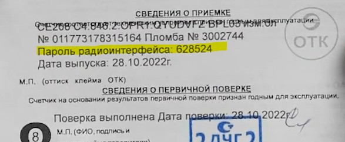

[СПОДЭС/DLMS/COSEM](https://github.com/latonita/esphome-dlms-cosem) •
[МЭК-61107/IEC-61107](https://github.com/latonita/esphome-iec61107-meter) •
[Энергомера МЭК/IEC](https://github.com/latonita/esphome-energomera-iec) •
[Энергомера CE](https://github.com/latonita/esphome-energomera-ce) •
[СПб ЗИП ЦЭ2727А](https://github.com/latonita/esphome-ce2727a-meter) •
[Ленэлектро ЛЕ-2](https://github.com/latonita/esphome-le2-meter) •
[Пульсар-М](https://github.com/latonita/esphome-pulsar-m) •
[Энергомера BLE](https://github.com/latonita/esphome-energomera-ble)


# esphome-energomera-ble
Подключение EspHome к приборам учета (счетчикам) электроэнергии Энергомера CE208 C4 / CE308 C36 по протоколу Bluetooth Low Energey "BLE". Для работы требуется модуль esp32 с поддержкой BLE, т.е. esp32c2 или esp32s2 точно не подойдут.

# Настройка подключения
Для подключения к электросчетчику необходимо указать:
 - MAC адрес - либо из паспорта, либо воспользовавшись [ESP32 Bluetooth Low Energy Scanner](https://esphome.io/components/esp32_ble_tracker/#esp32-bluetooth-low-energy-tracker-automation) либо любым BLE сканером на мобильном телефоне
 - PIN код - либо в паспорте("BLE-пароль радиоинтерфейса"), либо в индикаторного устройства CE901 (пин код виден при недоступности прибора)


Необходимо подключить стандартные компоненты `esp32_ble_tracker` и `ble_client` с с указанными настройками.

```yaml
...
external_components:
  - source: github://latonita/esphome-energomera-ble
    refresh: 0s
    components: [energomera_ble]

esp32_ble_tracker:
  scan_parameters: 
    active: false       # можно включить для первичного поиска счетчика
    continuous: false   # постоянный поиск не нужен
  max_connections: 1

ble_client:
- id: ce308_ble
  mac_address: "11:22:33:44:55:66"
  auto_connect: false  # автоматическое подключение должно быть отключено
                       # используйте update_interval в energomera_ble

energomera_ble:
- id: ce308_meter
  ble_client_id: ce308_ble
  pin: 123456           # из паспорта или из индикаторного устройства CE901
  update_interval: 60s  # при опросе большого количества сенсоров можем не успеть за 60с, увеличьте до 2мин
...
```

# Настройка сенсоров для опроса счетчика
Реализованы два типа сенсоров:
- `sensor` - числовые данные, float
- `text_sensor` - текстовые данные в формате "как пришли от счетчика"
```yaml
sensor/text_sensor:
  - platform: energomera_ble
    name: Название сенсора латиницей
    request: ЗАПРОС()
    index: индекс ответа, по-умолчанию 1
    sub_index: суб-индекс внутри ответа, по-умолчанию 0 = весь ответ из скобок
    ... остальные стандартные параметры для сенсора ...
```

Названия функций для запроса берем из документации на счетчик. Если запрос возвращает несколько значений, то, по-умолчанию, берется первое, но можно выбрать указав номер ответа (индекс, начинается с 1). Если в скобках указано несколько значений через запятую, то можно указать какое именно брать (суб-индекс, начинается с 1).


Примеры запросов и ответов от счетчика:
|  Запрос | Ответ счетчика | Индекс | Суб-индекс | Результат | Комментарий |
|--|--|--|--|--|--|
| `VOLTA()` | `VOLTA(228.93)`| не указан | не указан | 228.93 | Однофазный ПУ |
| `VOLTA()` | `VOLTA(213.441)(237.273)(197.621)` | не указан | не указан | 213.441 | Трехфазный ПУ|
| `VOLTA()` | `VOLTA(213.441)(237.273)(197.621)` | 1 | не указан |  213.441 | -"- |
| `VOLTA()` | `VOLTA(213.441)(237.273)(197.621)` | 2 | не указан | 237.273 | -"- |
| `EMD01(0.0,1)` | `EMD01(20.08.24,0.45991)(0.41342)` | 1 | 2 | 0.45991 | |
| `EMD01(0.0,1)` | `EMD01(20.08.24,0.45991)(0.41342)` | 2 | не указан | 0.41342 | |

Запросы берем из руководств на счетчики. [Документация по командам CE208 и CE308](doc/ce208_ce308_iec_protocol.pdf), взятая с форума поддержки Энергомеры.
Формат ответов  конкретных команд можно увидеть в логах при включенном `logger: VERBOSE`.

### 7.1 Пример. Запрос потребления электроэнергии в кВт*ч
```yaml
sensor:
  - platform: energomera_ble
    request: EMD01(0.0,1)
    index: 1
    sub_index: 2
    name: Energy T1
    unit_of_measurement: kWh
    accuracy_decimals: 0
    device_class: energy
    state_class: total_increasing

  - platform: energomera_ble
    request: EMD01(0.0,1)
    index: 2
    name:  Energy T2
    unit_of_measurement: kWh
    accuracy_decimals: 0
    device_class: energy
    state_class: total_increasing
```
### 7.2 Пример. Запрос даты
Дату счетчик возвращает в формате `н.дд.мм.гг`, где - день недели 0 - воскресенье, 1 понедельник. 
Пример: `3.13.07.24`.
Превратить это в нормальную дату можно, например,так:
```yaml
text_sensor:
  - platform: energomera_ble
    name: Date
    request: DATE_()
    entity_category: diagnostic
    filters:
      - lambda: |-
          std::string str{x};
          str.erase(0,2);
          str.insert(6,"20");
          return str;
```

# Пример готовой конфигурации

Для трехфазного прибора учета Энергомера CE308

```yaml
esphome:
  name: energomera-ce308

esp32:
  board: esp32-s3-devkitc-1
  framework:
    type: esp-idf

external_components:
  - source: github://latonita/esphome-energomera-ble
    refresh: 0s
    components: [energomera_ble]


logger:
  
api:
  encryption:
    key: "xxxxxxxxxxxxxxxxxxxx"

wifi:
  ssid: !secret wifi_ssid
  password: !secret wifi_password


esp32_ble_tracker:
 scan_parameters: 
   active: true
   continuous: False
 max_connections: 1

ble_client:
 - mac_address: "11:22:33:44:55:66"
   id: ce308_ble
   auto_connect: false
    
energomera_ble:
  id: ce308_meter
  ble_client_id: ce308_ble
  pin: 123456
  update_interval: 120s

button:
  - platform: template
    name: "Remove bond"
    on_press:
      - lambda: id(ce308_meter).remove_bonding();
      
  - platform: template
    name: "Connect"
    on_press:
      - lambda: id(ce308_meter).try_connect();

  - platform: safe_mode
    name: "Restart (Safe Mode)"

  - platform: restart
    name: "Restart"

safe_mode:
  
sensor:

  - platform: energomera_ble
    name: Current L1
    request: CURRE()
    index: 1
    unit_of_measurement: A
    accuracy_decimals: 3
    device_class: current
    state_class: measurement

  - platform: energomera_ble
    name: Current L2
    request: CURRE()
    index: 2
    unit_of_measurement: A
    accuracy_decimals: 3
    device_class: current
    state_class: measurement

  - platform: energomera_ble
    name: Current L3
    request: CURRE()
    index: 3
    unit_of_measurement: A
    accuracy_decimals: 3
    device_class: current
    state_class: measurement

  - platform: energomera_ble
    name: Voltage L1
    request: VOLTA()
    index: 1
    unit_of_measurement: V
    accuracy_decimals: 3
    device_class: voltage
    state_class: measurement

  - platform: energomera_ble
    name: Voltage L2
    request: VOLTA()
    index: 2
    unit_of_measurement: V
    accuracy_decimals: 3
    device_class: voltage
    state_class: measurement

  - platform: energomera_ble
    name: Voltage L3
    request: VOLTA()
    index: 3
    unit_of_measurement: V
    accuracy_decimals: 3
    device_class: voltage
    state_class: measurement

  - platform: energomera_ble
    name: Active Power L1
    request: POWEP()
    unit_of_measurement: kW
    accuracy_decimals: 3
    index: 1
    device_class: power
    state_class: measurement

  - platform: energomera_ble
    name: Active Power L2
    request: POWEP()
    unit_of_measurement: kW
    accuracy_decimals: 3
    index: 2
    device_class: power
    state_class: measurement

  - platform: energomera_ble
    name: Active Power L3
    request: POWEP()
    unit_of_measurement: kW
    accuracy_decimals: 3
    index: 3
    device_class: power
    state_class: measurement

  - platform: energomera_ble
    name: Active Power Total
    request: POWEP()
    unit_of_measurement: kW
    accuracy_decimals: 3
    index: 4
    device_class: power
    state_class: measurement


  # - platform: energomera_ble
  #   name: Reactive Power L1
  #   request: POWEQ()
  #   unit_of_measurement: kVA
  #   accuracy_decimals: 3
  #   index: 1
  #   device_class: power
  #   state_class: measurement

  # - platform: energomera_ble
  #   name: Reactive Power L2
  #   request: POWEQ()
  #   unit_of_measurement: kVA
  #   accuracy_decimals: 3
  #   index: 2
  #   device_class: power
  #   state_class: measurement

  # - platform: energomera_ble
  #   name: Reactive Power L3
  #   request: POWEQ()
  #   unit_of_measurement: kVA
  #   accuracy_decimals: 3
  #   index: 3
  #   device_class: power
  #   state_class: measurement

  - platform: energomera_ble
    request: EMD01(0.0,1)
    index: 1
    sub_index: 2
    name: Energy consumed T1
    unit_of_measurement: kWh
    accuracy_decimals: 0
    device_class: energy
    state_class: total_increasing

  - platform: energomera_ble
    request: EMD01(0.0,1)
    index: 2
    name:  Energy consumed T2
    unit_of_measurement: kWh
    accuracy_decimals: 0
    device_class: energy
    state_class: total_increasing

  - platform: energomera_ble
    name: Frequency
    request: FREQU()
    unit_of_measurement: Hz
    accuracy_decimals: 2
    device_class: frequency
    state_class: measurement

  - platform: energomera_ble
    request: TERMO()
    name: Temperature
    unit_of_measurement: C
    accuracy_decimals: 1
    state_class: measurement
    filters:
      - multiply: 0.01

text_sensor:
  - platform: energomera_ble
    name: Serial number
    request: SNUMB()
    entity_category: diagnostic

  - platform: energomera_ble
    name: Time
    request: TIME_()
    entity_category: diagnostic

  - platform: energomera_ble
    name: Date
    request: DATE_()
    entity_category: diagnostic
    filters:
      - lambda: |-
          std::string str{x};
          str.erase(0,2);
          str.insert(6,"20");
          return str;

```
